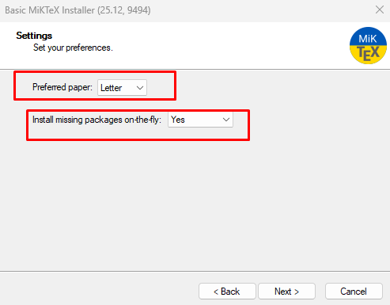
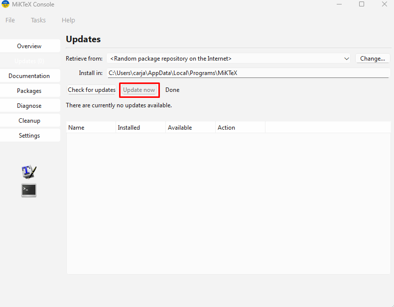
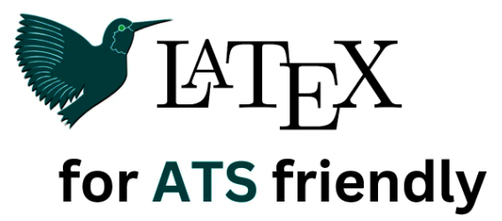

<p align="center"></p>
<h1 align="center"> LaTeX CV + Visual Studio Code </h1> 
<h4 align="right">Jan 26</h4>

<p>
  
  
</p>

<br>

# Table of contents
- [Table of contents](#table-of-contents)
- [Porque no usar Overleaf?](#porque-no-usar-overleaf)
- [Install](#install)
    - [Recomendaciones al compilar con Latex](#recomendaciones-al-compilar-con-latex)
- [CV ATS-Safe \& Optimizado](#cv-ats-safe--optimizado)
- [En la Experiencia Laboral](#en-la-experiencia-laboral)
    - [Promt para ayudar a convertir tareas en logros](#promt-para-ayudar-a-convertir-tareas-en-logros)
    - [Lenguaje Adecuado](#lenguaje-adecuado)
- [Las Fechas en los CV para ATS frendly](#las-fechas-en-los-cv-para-ats-frendly)
- [Keyword para trabajo Remoto](#keyword-para-trabajo-remoto)
- [Fuentes recomendadas para ATS-friendly](#fuentes-recomendadas-para-ats-friendly)
- [Recomendaciones](#recomendaciones)
- [Uso de keyword Stuffing en el CV, Spaw/Truco?](#uso-de-keyword-stuffing-en-el-cv-spawtruco)
  - [En mi Opinión](#en-mi-opinión)
- [Links](#links)

<br>

Compilando mi CV con LaTeX en VScode localmente. ```Optimizado para ATS ```. Fue probado en Windows, pero debria funcionar igual en linux.<br>

```LaTeX``` es un lenguaje de marcado para crear documentos profesionales (PDFs, libros, CVs, tesis, etc). Un CV mal formateado nunca pasara un ATS, hacerlo en latex garantiza un PDF liviano, mejor formateado y acto para aprobar un sistema ATS. Poder hacerlo localmente te permitira compilarlo las veces que sea necesario sin pagar nada. 

<br>

# Porque no usar Overleaf?
<p align="center"></p>
* El plan gratuito tiene límites de compilaciones automáticas simultáneas y menos tiempo de compilación en proyectos grandes. <br>
* Espacio y número de colaboradores limitado en el plan free.<br>
* Dependencia de internet para editar (aunque hay modo offline con planes pagos).<br>
* Puede ser más lento con proyectos muy grandes comparado a compilar localmente.<br>
  
<br>

# Install
1. Instalar latex-full<br> 
Para Windows MiKTeX: https://miktex.org/download<br>
> :bulb: **Tip:** En linux esta ***TeX Live full***. https://tug.org/texlive/. (version muy pesada, about 9Gb)

<p align="center"></p>

2. Update Miktek GUI ```(indispensable)```<br>

<p align="center"></p>

por consola:
```bash
miktex-console --check-updates
miktex-console --update
```

1. Instalar Perl (Para que latexmk funcione) 
Descarga e instala Strawberry Perl: https://strawberryperl.com/ (elige la versión "Recommended")


4. Usar latexmk con XeLaTeX para Compilar<br>
Ya podemos compilar un proyecto. Desde la consola vamos a la carpeta del proyecto y probamos compilar un archivo ***.tex***
```bash
latexmk -xelatex -synctex=1 -interaction=nonstopmode -file-line-error (nombre-archivo-latex).tex
#sample
latexmk -xelatex -synctex=1 -interaction=nonstopmode -file-line-error carjavi_cv.tex
latexmk -C # limpiar los errores
```
si todo sale bien se creara un archivo .PDF <br>
> :warning: **Warning:** No se puede compilar con pdflatex, esta configuración trabaja solo con ***XeLaTeX***. pdfLaTeX no soporta ciertos estilos de fuentes externas, si se desea una compilación mas general se debe usar LuaLaTeX | XeLaTeX.
 
1. Instalar extensión en VS Code
	1. En VS Code, ve a Extensions ***Ctrl + Shift + X***
	2. Busca LaTeX Workshop (James-Yu) e instálala

2. Configuración de ***settings.json*** en VScode
   1. Presiona la combinación de teclas ***Ctrl + Shift + P*** para abrir la paleta de comandos.
   2. Escribe la palabra ***json***
   3. Selecciona la opción que dice: ***Preferences: Open User Settings (JSON)***
   4. Busca la línea la última antes del ```}``` del json y coloca una coma ```,``` despues de la ultima linea,despues el siguiente codigo:
   ```bash
   "latex-workshop.latex.tools": [
        {
            "name": "latexmk-xelatex",
            "command": "latexmk",
            "args": [
                "-xelatex",
                "-synctex=1",
                "-interaction=nonstopmode",
                "-file-line-error",
                "%DOC%"
            ]
        }
    ],
    "latex-workshop.latex.recipes": [
        {
            "name": "latexmk (xelatex)",
            "tools": [
                "latexmk-xelatex"
            ]
        }
    ],
    "latex-workshop.latex.recipe.default": "latexmk (xelatex)"
   ```

   5. Guarda con Ctrl + S

3. Listo para Compilar en VScode
   1. Abre tu archivo ***name-latex-file.tex***
   2. Presiona ***Ctrl + Alt + B*** (o busca "Build" en la paleta de comandos).
   3. Debería compilar con latexmk -xelatex automáticamente y generar el archivo .PDF

> :warning: **Warning:** En la carpeta del proyecto deben estar los 3 archivos principales:<br>
 ```*.tex ```Archivo de texto plano que contiene código LaTeX (comandos, estructura, contenido). <br>
 ```*.sty ``` Son complementos o "plugins" que añaden funcionalidades específicas. comandos nuevos que no vienen por defecto en LaTeX (manejo de imágenes, colores, márgenes, hipervínculos). <br>
 ```*.cls ``` Es el esqueleto o la estructura global del documento. Se invoca siempre en la primera línea del archivo .tex con el comando \documentclass{nombre_de_la_clase}. clase personalizada (define estilos, colores, comandos como \cvitem, \skillbar).

### Recomendaciones al compilar con Latex
1. Cierra el PDF en cualquier visor (Adobe/Edge) antes de compilar. 
2. Desde la consola: 
```bash
latexmk -C # debería borrar el PDF sino borra el .pdf manualmente si quedó “enganchado”
``` 
3. Recompila desde el boton derecho superior de VScode "play"


<br>

<br>

# CV ATS-Safe & Optimizado

<p align="center"></p>

Los ATS (Sistema de Seguimiento de Candidatos) usan Parsing / NLP (resume parsing) para reconocer patrones en los layout de los CVs, por eso el PDF generado debe muy limpio y estándar en texto y estructura. Los reclutadores saben lo que quieren ver en un currículum y le dicen a los filtros ATS qué palabras clave tienen que formar parte de todos los que vayan a ser escogidos. Los programas ATS, incluso, pueden ordenar a los candidatos en función del número de veces que un término aparece.

Mejorar la compatibilidad para ATS (Applicant Tracking Systems):
1. Pocos iconos. igual los ATS los ignoran, pero archivos .SVG requiere librería que pueden corromper el PDF
2. No poner foto, imágenes o graficos
3. Usar fuentes estándar. intentar no usar fuentes externos. los ATS pueden pasar por alto las letras en una fuente decorativa, lo que hace que su contenido sea difícil de analizar
4. Usar títulos y encabezados claros en inglés o muy típicos. Ejemplo: “Work Experience” mejor que “Trayectoria profesional”. Otros Education, Experience, Skills etc
5. Evitar diseños raros, colores extremos
6. Intentar mantener el contenido en una sola columna o estructura simple
7. Pocas tablas complejas
8. Fechas y puestos en formatos estándar: Jan 2022 – Mar 2024, 2022-01 – 2024-03
9. Evitar iconos en vez de texto
10. las Keywords de los reclutadores deben agregarse especialmente en “Skills” y “Experience” 
11. Usa viñetas claras para describir logros y tareas

> :memo: **Note:** 
1. Algunos sistemas parsean mucho mejor DOCX que PDF (conviene tener las 2 versiones)
2. Si apuntas a portales globales, un CV en inglés suele parsearse mejor
3. A ciencia cierta, nunca se puede saber cómo un sistema ATS va a leer un currículum

<br>

# En la Experiencia Laboral 
Se colocan resultados, no tareas, se colocan en bullet y hay una regla, cada bullet responde ***¿para qué sirvió?*** ***¿que se consiguió con esto?***. En la mentalidad del reclutador; Una tarea dice qué hacías | Un logro dice qué valor generaste. Fórmula práctica: ```Acción + tecnología + impacto (resultado / contexto real)``` <br>

Si no tienes métricas duras, usa:<br>
* contexto crítico (mining, industrial, field)
* alcance (prototypes, first versions, production-ready)
* impacto operativo (reliability, deployment, validation)
  
Ejemplos de verbos fuertes (úsalos): <br>
* Co-developed "Participé en el desarrollo… "
* Designed
* Implemented
* Deployed
* Enabled
* Supported
* Provided specialized technical support "Se brindó soporte técnico especializado..."
* Contributed to
* Accelerated
* Improved
* Validated
* Engineerd
* Developed
* Developed first functional version "Desarrollé la primera versión funcional..."
* Integrated
* Optimized
* Conducted
* Collabored
* Authored
* Led the end-to-end manufacturing "Lideré la fabricación integral de..."

### Promt para ayudar a convertir tareas en logros
```
Actúa como un reclutador técnico senior con experiencia en la evaluación de perfiles de ingeniería y tecnología en distintos sectores, con dominio de sistemas ATS y redacción de CV de alto impacto. Comprende lenguaje técnico, valora experiencia práctica y en I+D, que sabe identificar aportes reales en entornos industriales, tecnológicos y multidisciplinarios. Quiero mejorar los bullets de mi experiencia laboral para mi CV. Te entregaré descripciones de tareas y debes convertirlas en logros usando la estructura: acción + tecnología utilizada + impacto (resultado o contexto real). No tengo métricas cuantitativas, así que utiliza verbos de acción fuertes y destaca alcance técnico, aplicación en entornos reales y valor operativo sin inventar información. Si el bullet no muestra impacto, pregúntame brevemente si resolví algún problema, logré algún resultado o usé tecnologías adicionales. Mantén cada bullet conciso, ATS-friendly y técnicamente creíble. Entrégame cada resultado en inglés y español con menos de 20 palabras y un maximo de 28.
```

### Lenguaje Adecuado
Trata de omitido ***repair*** y ya eres ingeniero porque ***maintenance*** y ***technical lifecycle*** ya lo cubren de forma más profesional. Un ingeniero ***mantiene y optimiza***, un técnico ***repara***. Mantén el lenguaje de ingeniero. 

<br>

# Las Fechas en los CV para ATS frendly
Los meses abreviados a 3 letras son estándar (Jan, Feb, Mar, Apr, May, Jun, Jul, Aug, Sep, Oct, Nov, Dec). <br>
Un ATS moderno sí los entiende, siempre que:
* Estén en inglés.
* El formato sea claro, por ejemplo: Jan 2022 – Mar 2024 o Mar 2024
  
Riesgos reales: <br>
* Abreviarlos en español (Ene, Feb, Mar…) → algunos ATS fallan.
* Usar formatos raros o mezclados.

<br>

# Keyword para trabajo Remoto
Herramientas que piden dominar en entrevistas de trabajo remoto, herramientas para gestión de tareas y proyectos, herramientas para comunicación remota asincrónica y sincrónica:
```
Work from home | Work from anywhere | Remote | Distributed | Virtual | Home office | Slack | Zoom | Microsoft Teams | Trello | Jira | Asana | Google Drive | Dropbox | GitHub | GitLab | Figma | Mural | Self-discipline | Communication | Initiative | Adaptability | Collaboration tools | Cloud | freelance Developer 
```

# Fuentes recomendadas para ATS-friendly
1. Times New Roman
2. Tahoma
3. Verdana
4. Arial
5. Helvética
6. Calibri
7. Georgia
8. Cambría
9. Gill Sans
10. Garamond

# Recomendaciones 
* Si tu currículum tiene mucho contenido, puedes intentar reducir los márgenes en un cuarto de pulgada cada vez. Lo ideal es que nunca sean menos de 0,5"/1.27cm/12.7mmm

* PROFILE SUMMARY Es lo primero que leerá un reclutador y lo que determinará si sigue leyendo o no. Se trata de un resumen de 3 a 5 líneas donde respondes:
    1. Quién eres a nivel laboral (profesión o área).
    2. En qué te has especializado.
    3. Tus principales fortalezas.
    4. Tu objetivo profesional actual.

<br>

# Uso de keyword Stuffing en el CV, Spaw/Truco?

El keyword stuffing literalmente significa "relleno de palabras clave". Es una práctica de Black Hat SEO consistente en la repetición excesiva e innatural de palabras clave (keywords) dentro de un contenido web, metaetiquetas, títulos o hasta CVs, para aumentar la visibilidad o para pasa un ATS sin tener todas las competencias que requiere el reclutador. Se suele hacer ocultando las palabras clave usando el mismo color de letra que el fondo así no mas!. 

Consecuencias:
1. Podría ser ignorado por algunos parsers que limpian contenido “no visible”.
2. Podría levantar banderas por patrones raros 
3. En internet se habla de penalización, pero básicamente es que te descarten en la selección. 

## En mi Opinión 
Podría ayudar a que los ATS vean ciertas palabras en que no están bien identificadas en el CV porque están representados por iconos o porque por estética del CV sean confusas para el ATS. La idea seria en no abusar de ellas, pero si no se incluyen las palabras que quieren en Recursos Humanos, estás fuera! 

<br>

# Links

More information: https://medium.com/@subhanusroy/a-beginners-guide-to-latex-for-ats-friendly-resumes-ab0919930a30

Convert your existing resume to an ATS-friendly format: https://resumedogs.com/

Our Free ATS Friendly Resume checker: https://www.atsfriendly.com/

ATS Resume Checker: https://zety.com/

Find Out if Your Resume is ATS-Optimized: https://enhancv.com/

<br>

<br>

---

<div>
  <p>
     Copyright &nbsp;&copy; 2023 Instinto Digital <a href="https://carjavi.github.io/" title="carjavi.github">carjavi</a>
  </p>
</div>

<p align="center">
    <a href="https://instintodigital.net/" target="_blank"></a>
</p>

